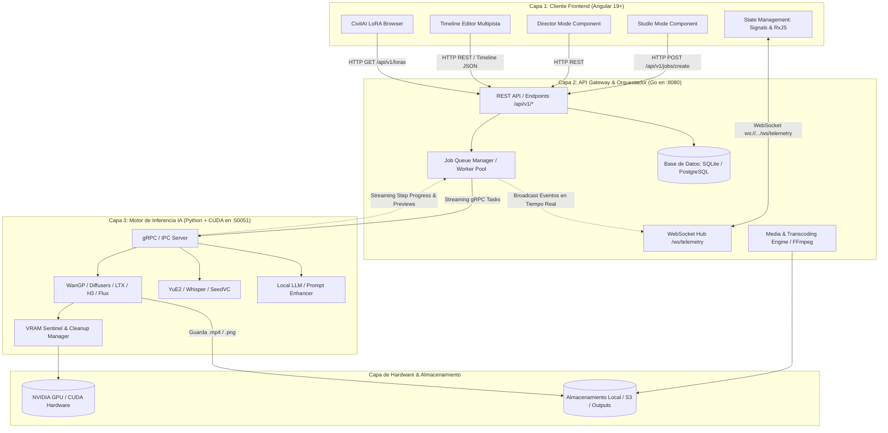
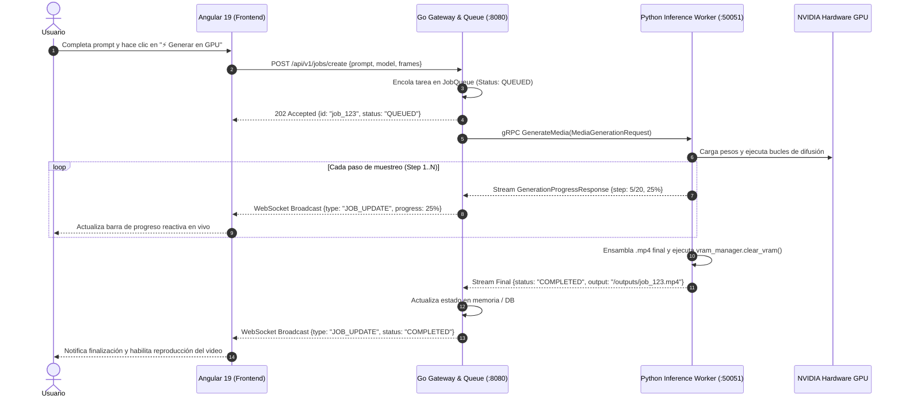

# 🧠 Plan de Arquitectura Híbrida: Angular + Go + Python (Maestro AI / Brain-Master)

Este documento detalla el diseño, la arquitectura técnica, los contratos de comunicación y las estrategias de despliegue para la suite creativa multimedia **Maestro / Brain-Master**, estructurada en una **Arquitectura Híbrida de 3 Capas Desacopladas**:
1. **Capa 1 (Frontend):** Angular 19+ (SPA moderna con Standalone Components, Signals y RxJS)
2. **Capa 2 (Backend / Orquestador):** Go (API Gateway de alto rendimiento, Hub WebSocket, gestor de colas y motor FFmpeg)
3. **Capa 3 (Motor de Inferencia IA):** Python (Microservicio headless optimizado para PyTorch, Diffusers, CUDA Kernels, WanGP y gestión de VRAM)

---

## 1. Diagrama de Arquitectura del Sistema



---

## 2. Desglose Detallado de Cada Capa

### Capa 1: Frontend en Angular (19+)
Ubicación: [`brain-master/frontend/`](file:///c:/Users/Drako/Desktop/synapta/Maestro/brain-master/frontend)

* **Arquitectura de Componentes Standalone:**
  * **🎨 Studio Generator:** Formulario con selección de modelos generativos (*Wan 2.1 Video 14B, MiniMax H3, LTX-Video 2.5, Flux 2 Klein*), prompts positivos/negativos, configuración de dimensiones (1080p, 720p), FPS y duraciones en segundos.
  * **🎬 Director Mode:** Planificador de guiones y tomas cinemáticas con detección de BPM de audio, estructuración de versos/coros y desglose de movimientos de cámara (Dolly, Drone Orbit, Lateral Tracking).
  * **✂️ Timeline Editor Multipista:** Editor no destructivo con soporte para pistas de video, pistas de audio y capas de títulos/efectos, visualizador de timecode y reproductor de canvas integrado.
  * **🛒 CivitAI LoRA Browser:** Catálogo interactivo de LoRAs con palabras clave de activación (*trigger words*), pesos sugeridos y filtros por estilo, personaje o iluminación.
* **Reactividad:**
  * **Angular Signals:** Control granular del estado de la interfaz sin re-renderizados innecesarios.
  * **RxJS (`WebSocketService`):** Manejo de streams de telemetría y actualización en vivo del porcentaje de avance (0% a 100%).

---

### Capa 2: API Gateway y Orquestador en Go
Ubicación: [`brain-master/backend/`](file:///c:/Users/Drako/Desktop/synapta/Maestro/brain-master/backend)

* **Servidor HTTP REST (Puerto 8080):**
  * `GET /api/v1/health`: Verificación de estado del gateway y latencia.
  * `POST /api/v1/jobs/create`: Encolado no bloqueante de tareas de generación multimedia.
  * `GET /api/v1/jobs`: Listado de trabajos activos, completados y fallidos.
  * `GET /api/v1/jobs/detail?id={id}`: Consulta detallada de una tarea específica.
* **WebSocket Hub (`/ws/telemetry`):**
  * Mantiene conexiones concurrentes y realiza *broadcasting* de eventos (`JOB_UPDATE`, `GPU_METRICS`, `OOM_WARNING`) a todos los clientes Angular conectados.
* **Job Queue Manager:**
  * Cola concurrente con buffer configurable que gestiona el acceso ordenado a la GPU, evitando saturar la memoria VRAM y permitiendo cancelaciones de tareas en caliente.
* **Motor FFmpeg:**
  * Ejecución nativa de tareas de transcodificación, unión de clips y renderizado de la línea de tiempo sin sobrecargar el runtime de Python.

---

### Capa 3: Motor de Inferencia IA en Python
Ubicación: [`brain-master/inference-worker/`](file:///c:/Users/Drako/Desktop/synapta/Maestro/brain-master/inference-worker)

* **Módulos Especializados:**
  * **Diffusion Pipelines:** Wan 2.1, LTX-Video, MiniMax H3, Flux y Diffusers.
  * **Audio & Voice:** YuE2 (música estéreo 48 kHz), Whisper (transcripción/diarización) y Seed-VC (conversión de voz).
  * **Local LLM Engine:** Orquestación de `llama-server` / GGUF (Gemma 4 / Qwen) para asistencia de guiones y refinamiento de prompts.
  * **VRAM Manager ([`vram_manager.py`](file:///c:/Users/Drako/Desktop/synapta/Maestro/brain-master/inference-worker/vram_manager.py)):** Telemetría continua de memoria asignada/reservada en GPU y ejecución de `torch.cuda.empty_cache()` tras cada ciclo de generación.

---

## 3. Contratos de Comunicación y Protocol Buffers

### Definición gRPC ([`brain-master/proto/inference.proto`](file:///c:/Users/Drako/Desktop/synapta/Maestro/brain-master/proto/inference.proto))

```protobuf
syntax = "proto3";

package maestro.inference.v1;

option go_package = "brain-master/backend/proto/inference/v1;inferencev1";

service InferenceService {
  // Streaming de progreso de generación de video/imagen
  rpc GenerateMedia (MediaGenerationRequest) returns (stream GenerationProgressResponse);
  
  // Transcripción y análisis de audio
  rpc TranscribeAudio (AudioTranscriptionRequest) returns (TranscriptionResponse);
  
  // Mejora de prompts con LLM local
  rpc EnhancePrompt (PromptEnhanceRequest) returns (PromptEnhanceResponse);
  
  // Estado y telemetría de GPU / VRAM
  rpc GetGpuTelemetry (GpuTelemetryRequest) returns (GpuTelemetryResponse);
}

message MediaGenerationRequest {
  string job_id = 1;
  string mode = 2; // "video" | "image"
  string model_name = 3;
  string prompt = 4;
  string negative_prompt = 5;
  int32 width = 6;
  int32 height = 7;
  int32 num_frames = 8;
  int32 fps = 9;
  int32 steps = 10;
  float cfg_scale = 11;
  int64 seed = 12;
  repeated LoraConfig loras = 13;
}

message LoraConfig {
  string name = 1;
  string path = 2;
  float weight = 3;
}

message GenerationProgressResponse {
  string job_id = 1;
  int32 current_step = 2;
  int32 total_steps = 3;
  float percentage = 4;
  string eta_seconds = 5;
  string status = 6; // "QUEUED", "PROCESSING", "COMPLETED", "FAILED"
  string preview_base64 = 7;
  string output_file_path = 8;
  string error_message = 9;
}
```

---

## 4. Diagrama de Secuencia End-to-End



---

## 5. Estrategias y Opciones de Despliegue (GPU Inference)

### 📊 Comparativa de Infraestructura

| Opción | Caso de Uso Ideal | Modelo de Costos | Latencia (*Cold-Start*) | Complejidad de Operación |
| :--- | :--- | :--- | :--- | :--- |
| **1. Serverless GPU (Modal / RunPod)** | SaaS en fase inicial, tráfico intermitente | 🟢 Pago por segundo (Escala a 0) | 🟡 Media (Carga de pesos bajo demanda) | 🟢 Baja (Totalmente administrado) |
| **2. Cloud GPU Dedicada (RunPod / Vast / Lambda)** | Tráfico continuo, producción con baja latencia | 🟡 Fijo por hora ($0.20 - $0.80 / h) | 🟢 Inmediata (Modelos precargados en VRAM) | 🟢 Media (Docker + NVIDIA Toolkit) |
| **3. Servidor Local / On-Premise (Workstation)** | Uso de estudio propio, privacidad absoluta | 🟢 $0 recurrente (Hardware propio) | 🟢 Inmediata | 🟢 Baja (Red local o Tailscale) |
| **4. Cloud Hyperscalers (AWS / GCP / Azure)** | Empresas con normativas de compliance y SLA | 🔴 Elevado ($1.50 - $4.00+ / h) | 🟢 Inmediata | 🔴 Alta (VPC, IAM, EKS) |
| **5. Clúster Kubernetes + KEDA / Ray / KServe** | SaaS a gran escala con múltiples nodos GPU | 🔴 Alto (Infraestructura distribuida) | 🟢 Excelente con Auto-scaling elástico | 🔴 Muy Alta |

---

### 🐳 Configuración Unificada con Docker Compose

```yaml
version: '3.8'

services:
  # Capa 1: Frontend Angular (Servido vía Nginx)
  frontend:
    build:
      context: ./brain-master/frontend
      dockerfile: Dockerfile
    ports:
      - "4200:80"
    depends_on:
      - backend-gateway

  # Capa 2: API Gateway y Orquestador en Go
  backend-gateway:
    build:
      context: ./brain-master/backend
      dockerfile: Dockerfile
    ports:
      - "8080:8080"
    environment:
      - PORT=8080
      - PYTHON_WORKER_HOST=python-inference:50051
    volumes:
      - ./brain-master/backend/outputs:/app/outputs
    depends_on:
      - python-inference

  # Capa 3: Motor de Inferencia IA en Python
  python-inference:
    build:
      context: ./brain-master/inference-worker
      dockerfile: Dockerfile
    environment:
      - GRPC_PORT=50051
    volumes:
      - ./brain-master/backend/outputs:/app/outputs
      - ./app/models:/app/models
    deploy:
      resources:
        reservations:
          devices:
            - driver: nvidia
              count: all
              capabilities: [gpu]
```

---

## 6. Ventajas Técnicas de la Arquitectura Híbrida

1. **Rendimiento y Escalabilidad:** Go maneja miles de conexiones HTTP y WebSockets concurrentes con consumo mínimo de RAM y sin bloquear el Event Loop.
2. **Mantenibilidad Frontend:** Angular proporciona un marco estructurado con TypeScript estricto, inyección de dependencias y Signals reactivos para interfaces complejas.
3. **Aislamiento de Fallos y VRAM:** Si un proceso de inferencia de Python sufre un error de memoria (OOM), el Gateway en Go y la interfaz en Angular permanecen 100% operativos, informando al usuario limpiamente sin congelar la app.
4. **Despliegue Flexible:** Permite ejecutar la inferencia de Python en un servidor con GPU remota o cloud mientras Go y Angular corren en cualquier servidor ligero o local.

---

## 7. 📋 Guía Paso a Paso de Ejecución e Implementación

Sigue estos pasos en orden para levantar, probar y avanzar con el proyecto híbrido:

### 🔹 Paso 1: Iniciar y Verificar el Gateway en Go

El Gateway de Go gestiona las peticiones REST, la cola de tareas GPU y la telemetría en tiempo real por WebSockets.

1. Abre una terminal en el directorio del backend:
   ```powershell
   cd c:\Users\Drako\Desktop\synapta\Maestro\brain-master\backend
   ```
2. Ejecuta el servidor (o el binario precompilado):
   ```powershell
   go run main.go
   # O alternativamente:
   .\brain-master-server.exe
   ```
3. Verifica que el servidor responda correctamente:
   ```powershell
   Invoke-RestMethod -Uri "http://127.0.0.1:8080/api/v1/health" | ConvertTo-Json
   ```
   *Respuesta esperada:* `{"service": "brain-master-gateway", "status": "healthy"}`

---

### 🔹 Paso 2: Ejecutar el Worker de Inferencia Python

El worker procesa los trabajos de difusión en la GPU y reporta el progreso paso a paso.

1. Abre una segunda terminal y navega al worker de Python:
   ```powershell
   cd c:\Users\Drako\Desktop\synapta\Maestro\brain-master\inference-worker
   ```
2. Instala las dependencias necesarias:
   ```powershell
   uv pip install -r requirements.txt
   ```
3. Inicia el servidor/motor de inferencia:
   ```powershell
   python server.py
   ```
   *Verifica que detecte el estado de la GPU y la memoria VRAM disponible.*

---

### 🔹 Paso 3: Instalar y Levantar el Frontend en Angular

1. Abre una tercera terminal en la carpeta del frontend:
   ```powershell
   cd c:\Users\Drako\Desktop\synapta\Maestro\brain-master\frontend
   ```
2. Instala los paquetes de Node.js:
   ```powershell
   npm install
   ```
3. Inicia el servidor de desarrollo de Angular:
   ```powershell
   npm start
   ```
4. Abre tu navegador web en **`http://localhost:4200`**:
   * Verifica que el indicador superior muestre: **`● Go Gateway Conectado (Port 8080)`**.
   * Navega entre los tabs: **Studio**, **Director Mode**, **Timeline Editor** y **LoRAs & CivitAI**.

---

### 🔹 Paso 4: Probar la Generación End-to-End

1. En la pestaña **Studio** de Angular:
   * Ingresa un prompt descriptivo (ej. *"A cinematic cyberpunk city in neon rain, 4k"*).
   * Selecciona el modelo deseado (*Wan 2.1 Video* o *Flux 2 Klein*).
   * Haz clic en **"⚡ Generar en GPU"**.
2. **Observa el flujo reactivo:**
   * Angular envía la petición `POST /api/v1/jobs/create` a Go.
   * Go encola el trabajo con estado `QUEUED` y lo pasa al worker.
   * El WebSocket emite el avance (10%..50%..100%) en tiempo real a la interfaz.
   * Al finalizar, el video aparece completado en la interfaz y guardado en `brain-master/backend/outputs/`.

---

### 🔹 Paso 5: Conectar Modelos Reales de Difusión (WanGP / Maestro)

Para conectar los pesos de modelos reales ya descargados en Maestro:
1. Asegúrate de que los checkpoints de modelos (`.safetensors`) estén en la carpeta `app/models/`.
2. En [`brain-master/inference-worker/server.py`](file:///c:/Users/Drako/Desktop/synapta/Maestro/brain-master/inference-worker/server.py), importa el cargador de modelos de `app/wgp.py` o utiliza `diffusers.WanPipeline` / `diffusers.FluxPipeline`.
3. El `VRAMManager` se encargará de liberar la memoria automáticamente tras cada generación para evitar errores de memoria (OOM).

---

### 🔹 Paso 6: Despliegue en Producción (Cloud / SaaS)

* **Para desplegar en servidor con Docker:**
  ```powershell
  cd c:\Users\Drako\Desktop\synapta\Maestro\brain-master
  docker-compose up --build
  ```
* **Para desplegar en Serverless GPU (Modal / RunPod):**
  * Sube el contenedor de `inference-worker` a Modal o RunPod Serverless.
  * Configura en el backend de Go la variable de entorno `PYTHON_WORKER_HOST` apuntando a la URL del endpoint serverless.

